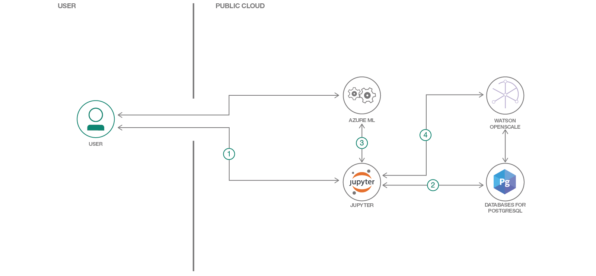

# Monitor Azure ML With Watson OpenScale

In this Code Pattern, we will use fictional sales data to create a logistic regression model using Azure Machine Learning Studio. We will use Watson OpenScale to bind the ML model deployed in the Azure cloud, create a subscription, and perform payload and feedback logging.

When the reader has completed this Code Pattern, they will understand how to:

* Prepare data, train a model, and deploy using Azure Machine Learning Studio
* Score the model using sample scoring records and the scoring endpoint
* Setup Watson OpenScale Data Mart
* Bind the Azure model to the Watson OpenScale Data Mart
* Add subscriptions to the Data Mart
* Enable payload logging and performance monitoring for both subscribed assets
* Use Data Mart to access tables data via subscription



## Flow

1. The developer creates a Jupyter Notebook.
2. The Jupyter Notebook is connected to a PostgreSQL database, which is used to store Watson OpenScale data.
3. An ML model is created using Azure ML Studio, using data from [GoSales_Tx](https://github.com/IBM/monitor-azure-ml-with-ai-openscale/data/GoSales_Tx.csv),  and then it is deployed to the cloud.
4. Watson Open Scale is used by the notebook to log payload and monitor performance.

## Prerequisites

* An [IBM Cloud Account](https://console.bluemix.net).
* [IBM Cloud CLI](https://console.bluemix.net/docs/cli/index.html#overview)
* An account on [Azure Machine Learning Studio](https://studio.azureml.net)

# Steps

1. [Clone the repository](#1-clone-the-repository)
1. [Create a Databases for PostgreSQL DB](#2-create-a-databases-for-postgresql-db)
1. [Create a Watson OpenScale service](#3-create-a-watson-openscale-service)
1. [Run the notebook](#4-run-the-notebook)

### 1. Clone the repository

```bash
git clone https://github.com/IBM/monitor-sagemaker-ml-with-ai-openscale
cd monitor-sagemaker-ml-with-ai-openscale
```

### 2. Create a Databases for PostgreSQL DB

* Using the [IBM Cloud Dashboard](https://console.bluemix.net/catalog) catalog, search for PostgreSQL and choose the `Databases for Postgres` [service](https://console.bluemix.net/catalog/services/databases-for-postgresql):

* Wait a couple of minutes for the database to be provisioned.
* Click on the `Service Credentials` tab on the left and then click `New credential +` to create the service credentials. Copy them or leave the tab open to use later in the notebook.

### 3. Create a Watson OpenScale service

* Using the [IBM Cloud Dashboard](https://console.bluemix.net/dashboard/apps) create a [Watson OpenScale](https://console.bluemix.net/catalog/services/ai-openscale) service.
* You will get the Watson OpenScale instance GUID when you run the notebook using the [IBM Cloud CLI](https://console.bluemix.net/catalog/services/ai-openscale)

### 4. Run the notebook

* [Create an experiment in Azure ML Studio](https://docs.microsoft.com/en-us/azure/machine-learning/studio/create-experiment) using the diagram in the [notebook](notebooks/WatsonOpenScaleAndAzureMLengine.ipynb). (You can search for each module in the palette by name)
* When you get to the `Train Model` module, select the `Product Line` column as the label.
* Run the experiment to train the model.
* [Create (deploy) web service](https://docs.microsoft.com/en-us/azure/machine-learning/studio/publish-a-machine-learning-web-service) (Choose the `new` NOT `classic`)

* Follow the instructions for `ACTION: Get Watson OpenScale instance_guid and apikey` using the [IBM Cloud CLI](https://console.bluemix.net/docs/cli/index.html#overview)

How to get api key using ibmcloud console:
```bash
ibmcloud login --sso
ibmcloud iam api-key-create 'my_key'
```

How to get your Watson OpenScale instance GUID:
```bash
ibmcloud resource service-instance <WatsonOpenScale_instance_name>
```

* Enter the `instance_guid` and `apikey` in the next cell for the `WATSON_OS_CREDENTIALS`.
* In the cell after that enter `POSTGRES_CREDENTIALS` using the value for the PostreSQL credentials from [Step #2](#2-create-a-databases-for-postgresql-db).
* In the cell after `2.1 Bind Azure machine learning engine` enter the `client_id`, `client_secret`, `subscription_id`, and `tenant` for the `AZURE_ENGINE_CREDENTIALS`.
> NOTE: Setting up Azure Active Directory for the AZURE_ENGINE_CREDENTIALS is beyond the scope of this document. See [Azure documentation](https://docs.microsoft.com/en-us/azure/) for help with this.

* After running `3.1 Add subscriptions` you will get a `source_uid` to enter in the cell that follows.
* Move your cursor to each code cell and run the code in it. Read the comments for each cell to understand what the code is doing. **Important** when the code in a cell is still running, the label to the left changes to **In [\*]**:.
  Do **not** continue to the next cell until the code is finished running.

# Sample Output

See the [example notebook with output](examples/WatsonOpenScaleAndAzureMLengineExampleOutput.ipynb)

# License

This code pattern is licensed under the Apache License, Version 2. Separate third-party code objects invoked within this code pattern are licensed by their respective providers pursuant to their own separate licenses. Contributions are subject to the [Developer Certificate of Origin, Version 1.1](https://developercertificate.org/) and the [Apache License, Version 2](https://www.apache.org/licenses/LICENSE-2.0.txt).

[Apache License FAQ](https://www.apache.org/foundation/license-faq.html#WhatDoesItMEAN)
